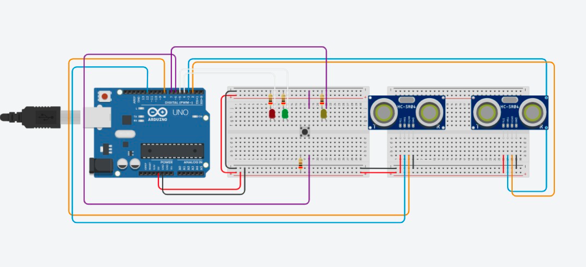
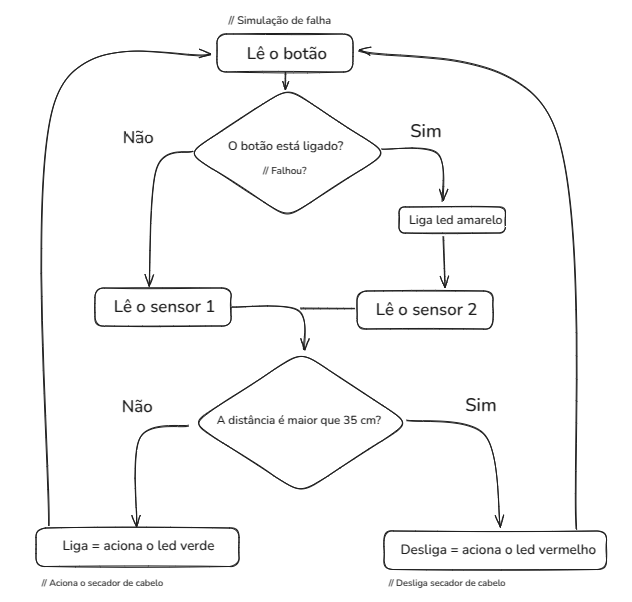

# Secador Inteligente com Redundância de Sensores

## Descrição do Projeto

Este projeto simula um "secador de cabelo inteligente" que economiza energia utilizando dois sensores ultrassônicos HC‑SR04 para medir a distância do secador do cabelo. Se o objeto estiver a menos de 35 cm, o sistema "liga" (LED verde); caso contrário, "desliga" (LED vermelho). Além disso, há um mecanismo de redundância: um botão simula a falha de um dos sensores e, em caso de erro, uma LED amarela indica que o sistema está lendo do sensor de backup.

## Objetivo

- Testar conceitos de redundância em sistemas embarcados
- Avaliar e otimizar consumo de energia em equipamentos elétricos
- Exercitar montagem de circuitos e lógica de programação em Arduino

## Lista de Componentes

- 1× Arduino Uno (ou compatível)
- 2× Sensor ultrassônico HC‑SR04
- 1× LED verde (representa "ligado")
- 1× LED vermelho (representa "desligado")
- 1× LED amarela (indica uso do sensor secundário)
- 1× Botão de pressão (push‑button)
- 2× Resistores de 220 Ω (para LEDs)
- 1× Resistor de 10 kΩ (pull‑down para o botão)
- Jumpers (fios macho‑macho)
- 1× Protoboard

> *Nota:* alguns componentes podem já estar integrados ao seu kit de desenvolvimento Arduino.

## Esquema de Ligação (Wiring)

## Lógica do Código (fluxograma)

## Teste e Validação

1. Com o botão solto (erro = false), aproxime um objeto a menos de 35 cm do sensor primário: o LED verde deve acender.
2. Aumente a distância acima de 35 cm: o LED vermelho deve acender.
3. Aperte o botão (erro = true): o LED amarelo acende, e a medição é feita pelo sensor secundário.
4. Repita os testes de distância para verificar o comportamento do sensor de backup.

---

*Projeto desenvolvido como atividade de aula para demonstrar redundância e controle de consumo de energia em sistemas embarcados.*

